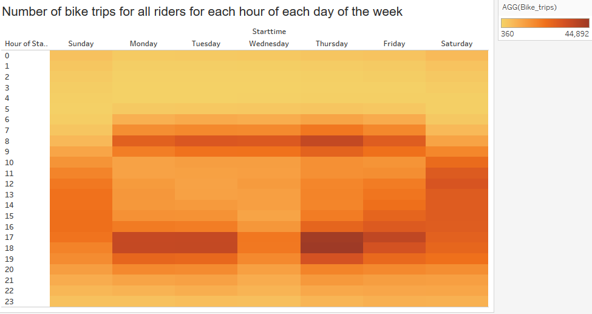
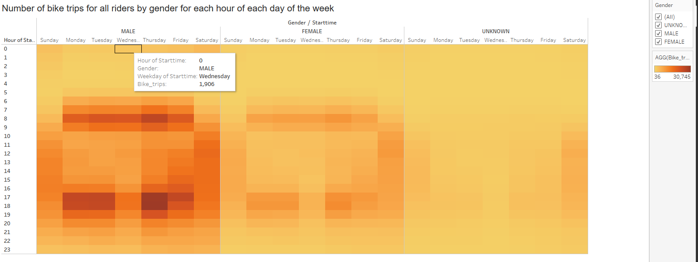
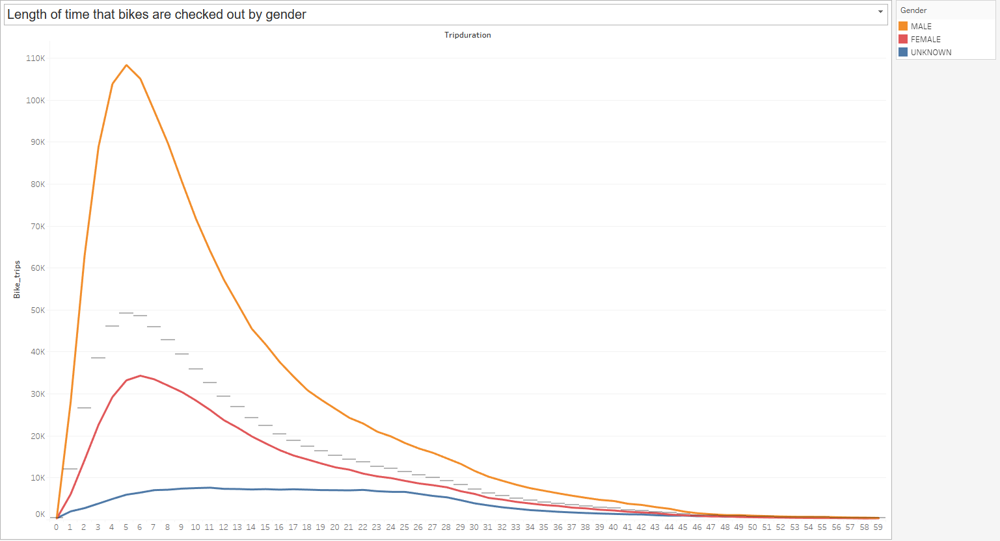
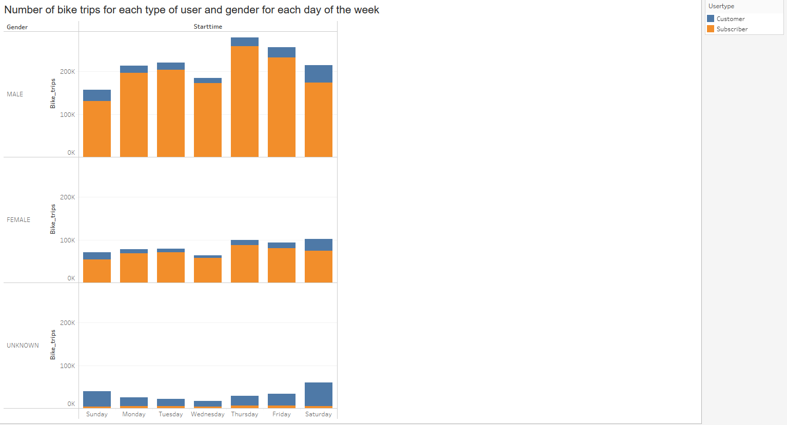
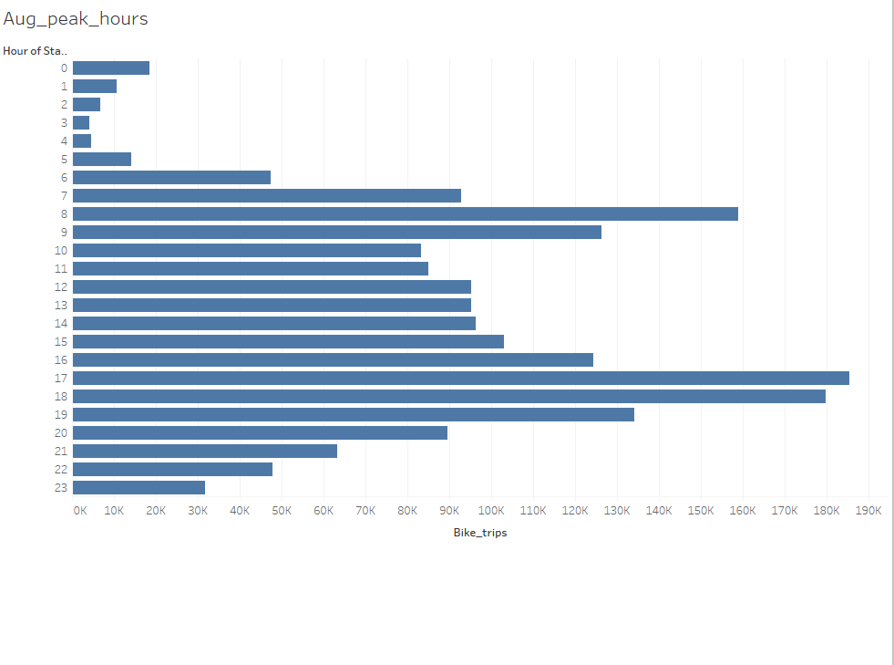
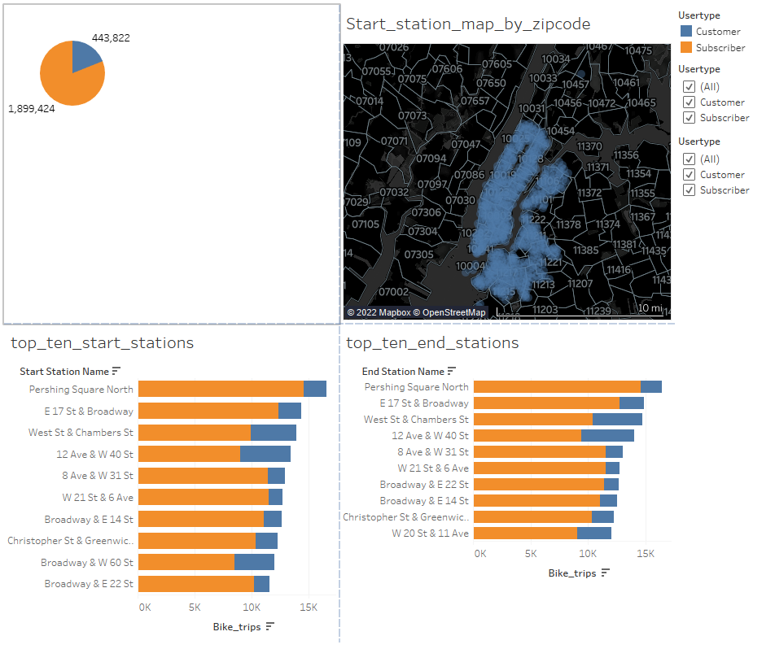
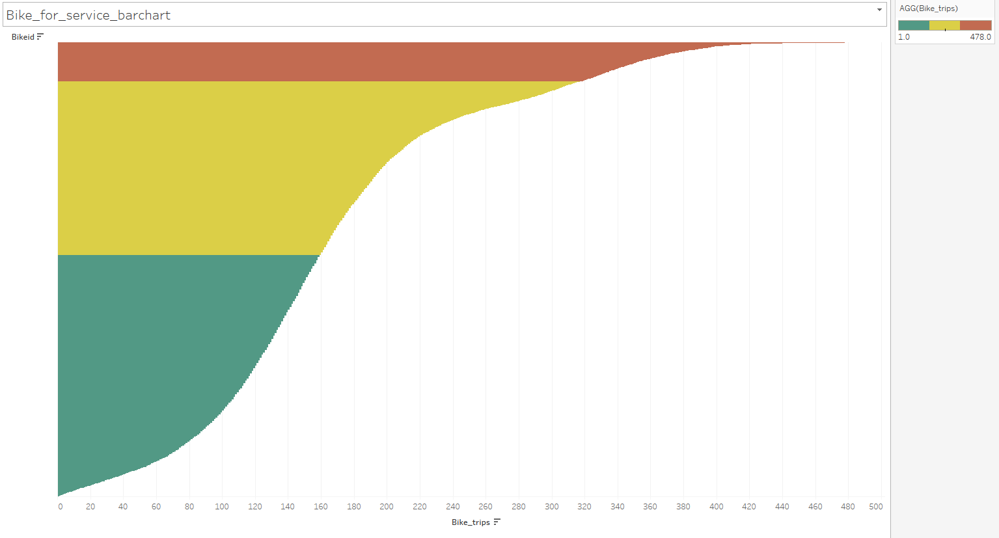
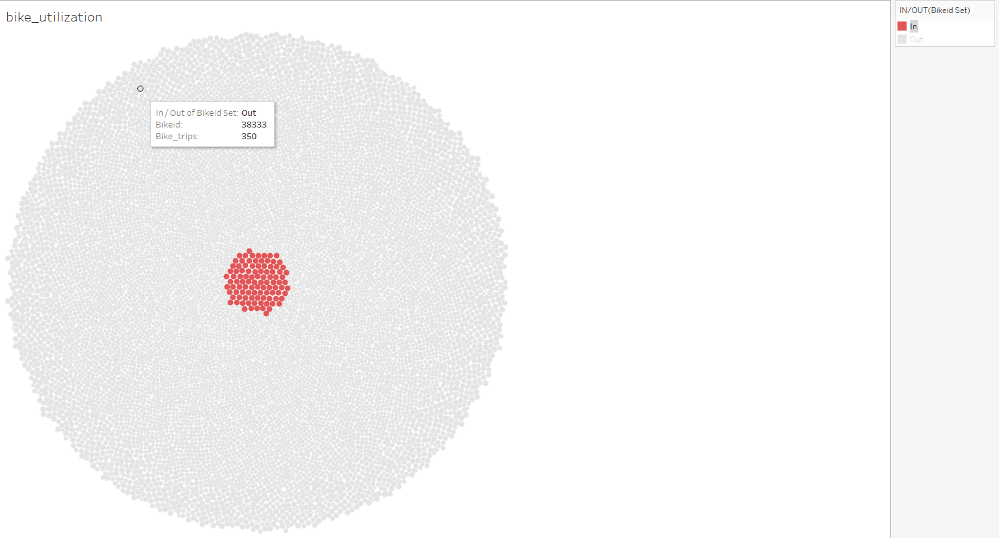
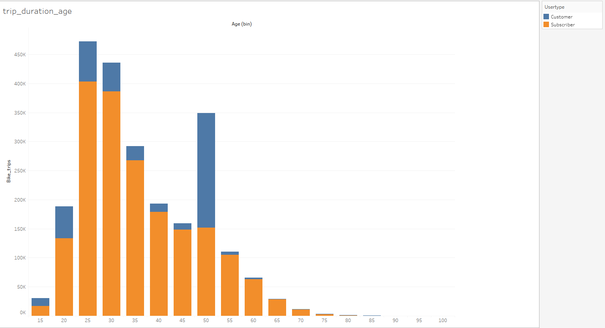

# Bikesharing with data from NYC CitiBike

An anyalysis of NYC Citibike data from August 2019

This story can be viewed at this [link](https://public.tableau.com/app/profile/chris3582/viz/CitiBikeStory_16631064117090/CitibikeStory)

## Overview

The purpose of this project is to analyze bikeshare data from Citibike located in NYC to present to investors who are looking to begin a bikeshare business in Des Moines, Iowa. One of the key stakeholders wants three key questions answered:

* The length of time that bikes are checked out for all riders and genders.
* The number of bike trips for all riders and genders for each hour of each day of the week.
* The number of bike trips for each type of user and gender for each day of the week.

## Results

### Trips by Weekday per hour

Monday through Friday the bikes are used the most during the morning and evening rush hour times. On weekends, Saturday seems to be the more popular day to use the bikes.

### Trips by Gender

As seen from the comparison above males clearly use the bikes more often than females or people in the unknown category.

### Checkout times by Gender

Males tend to take longer trips than females and people in the unknown category.

### Trips by user and gender

This breaks down the number of trips by the type of user and gender. Males 
use the bikes the most every day of the week.

### Peak hours 

This shows that the rush hours times periods in both the morning and night are when users rent the bikes the most.

### Top start and end stations

The top ten stations used the most are shown above. Pershing Square North and E17th St & Broadway are the two most used stations for both starting and ending a trip.

### Trips by Bike ID

This chart shows how many trips each bike made by associating trips to the bike ID. This can come in useful when determining to service an individual bike. Green are the least used bikes, yellow are used fairly often and red are used the most.

## Summary

The results of this analysis show the utilization of bikes in the Citibike bike sharing program based in NYC. The pattern of usage has been shown by relating time and by gender. Utilization rates can be predicted fairly accurately based on time and location. Weekday usage is at its heaviest around both the morning and evening rush hours. Weekend usage is spread out more evenly throughout the day.

Further analysis can be used to highlight two points worth looking into. The first is to analyze usage by age to see if there is an untapped market that can be catered towards. The second analysis is to determine which bikes are used most often to determine a maintenance schedule and to possibly rotate them with bikes used less often to get the maximum life span out of each bike.

Below are two analysis that have been performed to highlight these points.

### Bike Utilization

This shows which bikes are used most often by bike ID. The bikes in red are used the most while the bikes in gray are used less. The can alse be used to determine when an individual bike is to be serviced.

### Trip duration by age

People in their 20's use the bikes the most while people in their early 50's make up a fairly large group as well.